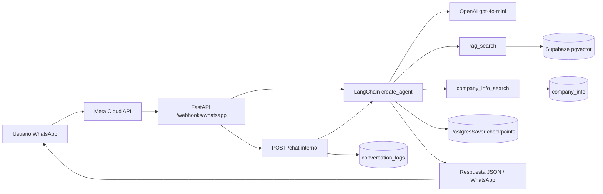

# Informe Técnico Final — Módulo 3  
## Asistente Corporativo Riopaila Castilla (Ruta A)

**Equipo:** TAMML — Tarea 1  
**Empresa:** Riopaila Castilla S.A. (Valle del Cauca)  
**Ruta elegida:** A — LangChain, FastAPI, WhatsApp **Vía 2 (webhook propio en FastAPI)**

---

## 1. Problema y solución

### Problema
Stakeholders, accionistas y público general necesitan respuestas rápidas y verificables sobre Riopaila Castilla (NIT, contacto, sostenibilidad, gobierno corporativo, líneas de negocio) sin depender de navegar múltiples PDFs y secciones del sitio web.

### Solución
Un **agente conversacional productizado** que:
- Consulta **datos estructurados** (`company_info` en Supabase) con esquemas Pydantic.
- Realiza **RAG semántico** sobre informes y comunicados indexados en pgvector.
- Mantiene **memoria por sesión** (número de teléfono o `session_id`) con PostgresSaver.
- Se expone vía **API REST** para canales externos (WhatsApp).

---

## 2. Evolución arquitectónica (Módulo 2 → Módulo 3)

| Aspecto | Módulo 2 | Módulo 3 |
|---------|----------|----------|
| Interfaz | Solo Streamlit | FastAPI + Streamlit (demo interna) |
| Herramientas | ReAct / texto libre | **Function Calling** con `StructuredTool` + Pydantic |
| Memoria agente | SQL / sesión UI | **PostgresSaver** (LangGraph) por `thread_id` |
| Canal usuario | Navegador | **WhatsApp** (N8N o webhook Meta) |
| Observabilidad | Panel fuentes en UI | `conversation_logs` + **t-SNE** (bonus) |

---

## 3. Arquitectura Ruta A (diagrama)

---

## 4. Componentes LangChain exigidos

| Componente | Ubicación | Función |
|------------|-----------|---------|
| `init_chat_model` | `agent.py` | LLM OpenAI con streaming |
| `create_agent` | `agent.py` | Orquestación del agente |
| `HumanInTheLoopMiddleware` | `agent.py` | Registrado; auto-aprobación en canales productivos |
| `dynamic_prompt` | `agent.py` | Ajuste de system prompt en hilos largos |
| `PostgresSaver` | `checkpoint_store.py` | Memoria persistente por `session_id` |
| `RecursiveCharacterTextSplitter` | `chunking.py`, `kb.py` | Chunking del corpus |
| Vector store LangChain | `rag_store.py` | `SupabaseVectorStore` + embeddings |
| Pydantic schemas | `schemas.py` | `RagSearchInput`, `CompanyInfoSearchInput` |
| `StructuredTool` | `tools/*.py` | Function calling estricto |
| Errores corteses | `tool_errors.py` | Sin alucinar si falla una tool |

---

## 5. API REST (productización)

- **Framework:** FastAPI (`src/riopaila_rag/api/main.py`)
- **Endpoints:**
  - `GET /health` — estado, tipo de checkpointer, WhatsApp configurado
  - `POST /chat` — `{ "message", "session_id" }` → `{ "reply", "session_id" }`
  - `DELETE /chat/{session_id}` — limpiar hilo
  - `GET/POST /webhooks/whatsapp` — Vía 2 Meta (opcional)

El `session_id` se mapea a `thread_id` en LangGraph → misma conversación para el mismo teléfono.

---

## 6. Integración WhatsApp (implementación activa: Vía 2)

### Vía 2 — Webhook en FastAPI (elegida en producción del proyecto)
- Módulo: `src/riopaila_rag/api/whatsapp.py`
- Flujo: Meta → ngrok → `GET/POST /webhooks/whatsapp` → agente → Graph API envía respuesta.
- Variables: `WHATSAPP_VERIFY_TOKEN`, `WHATSAPP_ACCESS_TOKEN`, `WHATSAPP_PHONE_NUMBER_ID`
- Formateo de respuesta: Markdown adaptado a WhatsApp (viñetas, negritas, sección Fuentes).
- `session_id` = número del usuario (`from`) para memoria por teléfono.

**Prueba en vivo:** App Meta **WA_MakilaGO**, número sandbox `+1 (555) 059-8036`, testers registrados en API Setup.

### Vía 1 — N8N (documentada como alternativa)
Workflow y guía disponibles en `docs/n8n/workflow_whatsapp_riopaila.json` y `docs/MODULO3_N8N_WHATSAPP.md`.

**Justificación Vía 2 vs N8N:** Menor latencia (un solo salto), menos dependencias operativas el día de la sustentación, y control total del formateo y manejo de errores en Python.

---

## 7. Gestión de errores

- Tools devuelven `[HERRAMIENTA_NO_DISPONIBLE]` con alternativas (`tool_errors.py`).
- API responde `503` si falta configuración; `500` genérico sin filtrar secretos.
- WhatsApp: mensaje amigable si el agente lanza excepción.

---

## 8. Bonus t-SNE (ruta transversal A)

1. Cada turno vía API/WhatsApp se guarda en `conversation_logs` (84+ registros tras seed).
2. Script `scripts/run_tsne.py` (o notebook `notebooks/tsne_conversaciones.ipynb`) genera embeddings OpenAI y proyecta con t-SNE.
3. Gráfico exportado: `docs/tsne_conversaciones.png`.

### Interpretación (ejecución real — 84 conversaciones)

| Intención | Cantidad | Lectura |
|-----------|----------|---------|
| legal/NIT | 22 | Clúster dominante: preguntas corporativas frecuentes (NIT, razón social). |
| contacto | 4 | Agrupación cercana por vocabulario de teléfonos, correo y PQRS. |
| sostenibilidad | 2 | Certificaciones e informe 2025 (subconjunto pequeño pero distinguible). |
| negocio | 2 | Líneas de caña y toneladas procesadas. |
| gobierno | 1 | Junta Directiva (pocos ejemplos en logs). |
| otros | 53 | Saludos, pruebas de demo, preguntas mixtas o transcripts cortos. |

**Conclusiones operativas:**
- El asistente concentra tráfico en **consultas legales/identificación**, coherente con el caso de uso Riopaila.
- El volumen en **otros** sugiere ampliar etiquetado o prompts para sostenibilidad/gobierno (menos datos de esas categorías en los logs actuales).
- Los puntos aislados en t-SNE corresponden a mensajes atípicos o sesiones de prueba durante desarrollo.

Comandos: `python scripts/seed_conversation_logs.py --api http://127.0.0.1:8000` y `python scripts/run_tsne.py`

---

## 9. Repositorio y buenas prácticas

- Código en `src/riopaila_rag/` con separación agent / tools / api / config.
- Migraciones versionadas en `supabase/migrations/`.
- `.env.example` sin secretos; verificación con `scripts/verify_modulo3.py`.
- Streamlit permanece como **panel de demostración interna**, no como producto final.

---

## 10. Conclusiones

El Módulo 3 convierte el prototipo Streamlit en un **servicio desplegable** alineado con la rúbrica: Function Calling estricto, API REST, canal WhatsApp y trazabilidad para análisis. La sustentación en vivo debe mostrar el flujo teléfono → API → agente → respuesta con memoria de contexto.

---

## Referencias rápidas

- `MODULO3.md` — resumen de etapas
- `docs/CHECKLIST_ENTREGA_MODULO3.md` — pasos operativos
- `docs/SUSTENTACION_EN_VIVO.md` — guion de 15 minutos
