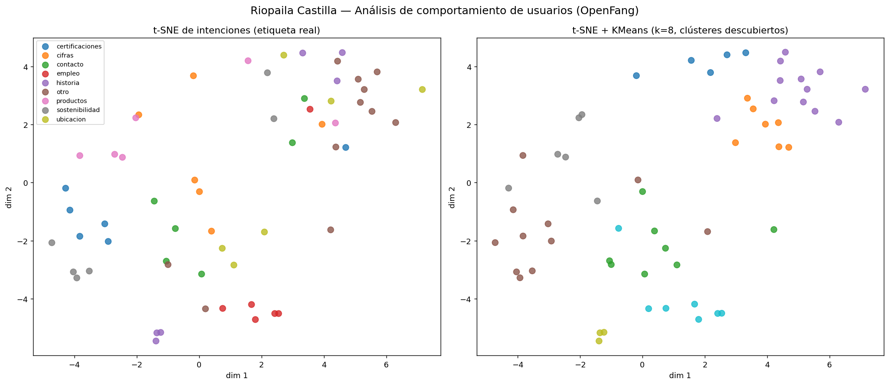

# Ruta Transversal B — Análisis de comportamiento de usuarios con t-SNE

> Componente de ciencia de datos sobre el historial de interacciones del agente de OpenFang.
> Proyecto Riopaila Castilla (TAMML — Tarea 1).

## Objetivo
Descubrir e interpretar **clústeres de intenciones de usuario** a partir del historial real de
conversaciones del agente, proyectando los mensajes (vectorizados) a 2D con **t-SNE**.

## Pipeline
1. **Extracción.** OpenFang guarda un espejo de cada sesión en archivos **JSONL**
   (`~/.openfang/workspaces/<agente>/sessions/*.jsonl`) y un índice **SQLite FTS5**. Se leen
   todos los JSONL y se extraen los mensajes de **rol `user`** (las intenciones), descartando
   ruido (`/start`, "Please continue", comandos, mensajes de sistema) y duplicados.
2. **Vectorización.** Cada mensaje se convierte en un embedding con **OpenAI
   `text-embedding-3-small`** (1536 dimensiones) — el mismo modelo del RAG del Módulo 2. Los
   embeddings se cachean en `data/analysis/embeddings.json` para no repetir llamadas.
3. **Reducción de dimensionalidad.** **t-SNE** (`sklearn.manifold.TSNE`) proyecta los vectores de
   1536-D a **2-D**. `perplexity` se ajusta al tamaño de la muestra.
4. **Clústeres.** **KMeans** sobre las coordenadas 2-D agrupa las intenciones de forma no
   supervisada.
5. **Visualización.** Gráfico de dos paneles (coloreado por intención real y por clúster KMeans),
   guardado en `data/analysis/tsne_intenciones.png`.
6. **Interpretación.** Por cada clúster se reporta la intención dominante, su **pureza** y ejemplos.

## Archivos
- `src/scripts/seed_interactions.py` — siembra interacciones representativas (8 intenciones ×
  6 formulaciones) para tener datos variados; en producción el historial lo generan los usuarios.
- `src/scripts/tsne_analysis.py` — pipeline completo (extracción → embeddings → t-SNE → KMeans →
  PNG + interpretación).
- `notebooks/analisis_tsne.ipynb` — versión notebook (renderiza el gráfico inline).
- `data/analysis/` — `intent_labels.json`, `embeddings.json` (caché), `tsne_intenciones.png`.

## Cómo ejecutar
```powershell
pip install numpy scikit-learn matplotlib openai     # dependencias
python src/scripts/seed_interactions.py              # (opcional) siembra historial variado
python src/scripts/tsne_analysis.py                  # genera el gráfico y la interpretación
# o abrir notebooks/analisis_tsne.ipynb
```

## Intenciones consideradas (siembra)
`contacto`, `productos`, `certificaciones`, `historia`, `sostenibilidad`, `cifras`, `ubicacion`,
`empleo` (8 categorías).

## Resultados

**Muestra analizada:** 59 mensajes de usuario (18 del historial JSONL real de los agentes
`riopaila-*` + 41 interacciones sembradas), vectorizados a 1536-D y normalizados (coseno).
**Gráfico:** `data/analysis/tsne_intenciones.png` (dos paneles: por intención real y por clúster).



**Clústeres descubiertos (KMeans k=8) e interpretación:**

| Clúster (intención dominante) | Pureza | Lectura |
|---|---|---|
| `historia` | **100%** | Preguntas de fundación/fusión/evolución se agrupan de forma muy nítida. |
| `empleo` | 71% | Vacantes y "cómo trabajar" forman un grupo coherente. |
| `otro` (factual real) | 58% | NIT, año de fundación e historia del **historial real** caen juntas. |
| `productos` | 50% | Azúcar, etanol, derivados. |
| `certificaciones` | 36% | ISO / sellos; se mezcla algo con productos. |
| `contacto` | 29% | Correos/web; solapa con `empleo` (ambas "llegar a la empresa"). |

**Pureza media: ~49%**, frente a un **baseline aleatorio de 12.5%** (8 clases) → ~4× mejor.

**Hallazgos:**
- Las intenciones con vocabulario distintivo (**historia, empleo, productos**) se separan bien.
- Hay solapamiento esperable entre **contacto/empleo** (semánticamente cercanas) y entre
  **certificaciones/productos**.
- La pregunta **fuera de alcance** ("¿Cuál es la capital de Francia?") queda **apartada** del resto
  — señal útil para detectar consultas que no son de la empresa.
- Con preguntas cortas del mismo dominio, la separación fina de 8 intenciones es intrínsecamente
  difícil; más volumen de historial real elevaría la pureza.

**Aplicación práctica:** este análisis permite identificar las **intenciones más frecuentes** de los
usuarios (p. ej. para priorizar FAQs, detectar temas fuera de alcance o ajustar los prompts de los
agentes especialistas).
